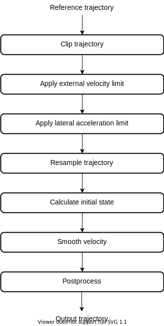

# Motion Velocity Smoother

## Purpose

`motion_velocity_smoother`は目標軌道上の各点における望ましい車速を計画して出力するモジュールである。
このモジュールは、速度の最大化と乗り心地の良さを両立するために、事前に指定された制限速度、制限加速度および制限躍度の範囲で車速を計画する。
加速度や躍度の制限を与えることは車速の変化を滑らかにすることに対応するため、このモジュールを`motion_velocity_smoother`と呼んでいる。

## Inner-workings / Algorithms

### Flow chart

#### Clip trajectory

自車後輪軸中心位置に最も近い参照経路上の点に対し、`extract_behind_dist`だけ戻った点から`extract_ahead_dist`だけ進んだ点までの参照経路を抜き出す。

#### Apply external velocity limit

外部から指定された速度制限を適用する。このとき、パラメータで指定されている減速度および躍度の制限の範囲で減速可能な位置から速度制限を適用する。

#### Apply lateral acceleration limit

経路の曲率に応じて、指定された最大横加速度`max_lateral_accel`を超えない速度を制限速度として設定する。ただし、制限速度は`min_curve_velocity`を下回らないように設定する。

#### Resample trajectory

最適化の計算負荷を軽減するため、指定された間隔で経路の点を再サンプルする。ただし、経路全体の長さは`min_trajectory_length`から`max_trajectory_length`の間となるように再サンプルを行い、点の間隔は`min_trajectory_interval_distance`より小さくならないようにする。

#### Calculate initial state

速度計画のための初期値を計算する。初期値は状況に応じて下表のように計算する。

| 状況 | 初期速度 | 初期加速度 |
| ---- | -------  | ---------- |
| 最初の計算時 | 現在車速 | 0.0 |
| 発進時 | `engage_velocity` | `engage_acceleration` |
| 現在車速と計画車速が乖離 | 現在車速 | 前回計画値 |
| 通常時 | 前回計画値 | 前回計画値 |

#### Smooth velocity

速度の計画を行う。速度計画のアルゴリズムは`JerkFiltered`, `L2`, `Linf`の3種類のうちからコンフィグで指定する。
最適化のソルバにはOSQP[1]を利用する。

##### JerkFiltered

速度の2乗（最小化で表すため負値で表現）、制限速度逸脱量の2乗、制限加度逸脱量の2乗、制限ジャーク逸脱量の2乗、ジャークの2乗の総和を最小化する。
詳しいアルゴリズムは[2]を参照。

##### L2

速度の2乗（最小化で表すため負値で表現）、制限速度逸脱量の2乗、制限加度逸脱量の2乗、疑似ジャーク[3]の2乗の総和を最小化する。

##### Linf

速度の2乗（最小化で表すため負値で表現）、制限速度逸脱量の2乗、制限加度逸脱量の2乗の総和と疑似ジャーク[3]の絶対最大値の和の最小化する。

#### Post process

計画された軌道の後処理を行う。
- 停止点より先の速度を0に設定
- 速度がパラメータで与えられる`max_velocity`以下となるように設定
- 自車位置より手前の点における速度を設定
- デバッグデータの出力

## Inputs / Outputs

### Input

  | Name                 | Type                                                | Description          |
  | -------------------- | --------------------------------------------------- | -------------------- |
  | `~/input/trajectory` | `autoware_planning_msgs/Trajectory`           | Reference trajectory |
  | `/planning/scenario_planning/max_velocity`  | `std_msgs/Float32` | External velocity limit [m/s] |
  | `/localization/twist` | `geometry_msgs/TwistStamped` | Current twist |
  | `/tf` | `tf2_msgs/TFMessage` | TF |
  | `/tf_static ` | `tf2_msgs/TFMessage` | TF static |

  ### Output

  | Name                  | Type                                      | Description         |
  | --------------------- | ----------------------------------------- | ------------------- |
  | `~/output/trajectory` | `autoware_planning_msgs/Trajectory` | Modified trajectory |
  | `/planning/scenario_planning/current_max_velocity` | `std_msgs/Float32` | Current external velocity limit [m/s] |
  | `~/closest_velocity` | `std_msgs/Float32` | Planned velocity closest to ego base_link (for debug) |
  | `~/closest_acceleration` | `std_msgs/Float32` | Planned acceleration closest to ego base_link (for debug) |
  | `~/closest_jerk` | `std_msgs/Float32` | Planned jerk closest to ego base_link (for debug) |
  | `~/debug/trajectory_raw` | `autoware_planning_msgs/Trajectory` | Extracted trajectory (for debug) |
  | `~/debug/trajectory_external_velocity_limited` | `autoware_planning_msgs/Trajectory` | External velocity limited trajectory (for debug) |
  | `~/debug/trajectory_lateral_acc_filtered` | `autoware_planning_msgs/Trajectory` | Lateral acceleration limit filtered trajectory (for debug) |
  | `~/debug/trajectory_time_resampled` | `autoware_planning_msgs/Trajectory` | Time resampled trajectory (for debug) |
  | `~/distance_to_stopline` | `std_msgs/Float32` | Distance to stop line from current ego pose (max 50 m) (for debug) |
  | `~/stop_speed_exceeded` | `std_msgs/Bool` | It publishes `true` if planned velocity on the point which the maximum velocity is zero is over threshold |

## Parameters

### Constraint parameters

|Name|Type|Description|Default value|
|:--|:--|:--|:--|
|`max_velocity`| `double`| Max velocity limit [m/s] | 20.0  |
|`max_accel`| `double`| Max acceleration limit [m/ss] | 1.0   |
|`min_decel`| `double`| Min deceleration limit [m/ss] | -1.0  |
|`max_jerk`| `double`| Max jerk limit [m/sss] | 0.3 |
|`min_jerk`| `double`| Min jerk limit [m/sss] | -0.3 |

### Curve parameters

|Name|Type|Description|Default value|
|:--|:--|:--|:--|
|`max_lateral_accel`| `double` | Max lateral acceleration limit [m/ss] | 0.5
|`min_curve_velocity`| `double` | Min velocity at lateral acceleration limit [m/ss] | 2.74
|`decel_distance_before_curve`| `double` | Distance to slowdown before a curve for lateral acceleration limit [m] | 3.5
|`decel_distance_after_curve`| `double` | Distance to slowdown after a curve for lateral acceleration limit [m] | 2.0

### Engage & replan parameters

|Name|Type|Description|Default value|
|:--|:--|:--|:--|
|`replan_vel_deviation`| `double` | Velocity deviation to replan initial velocity [m/s]|5.53|
|`engage_velocity`| `double` | Engage velocity threshold [m/s] (if the trajectory velocity is higher than this value, use this velocity for engage vehicle speed)|0.25|
|`engage_acceleration`| `double` | Engage acceleration [m/ss] (use this acceleration when engagement)|0.1 |
|`engage_exit_ratio`| `double`  | Exit engage sequence to normal velocity plannning when the velocity exceeds engage_exit_ratio x engage_velocity.|0.5 |
|`stop_dist_to_prohibit_engage`| `double` | If the stop point is in this distance, the speed is set to 0 not to move the vehicle [m]|0.5 |

### Trajectory clipping & resampling parameters

|Name|Type|Description|Default value|
|:--|:--|:--|:--|
|`extract_ahead_dist`| `double` | Forward trajectory distance used for planning [m] |  200.0  |
|`extract_behind_dist`| `double` | backward trajectory distance used for planning [m] |  5.0    |
|`delta_yaw_threshold`| `double` | Allowed delta yaw between ego pose and trajectory pose [radian] |  1.0472 |
|`max_trajectory_length`| `double` |Max trajectory length for resampling [m]|  200.0|
|`min_trajectory_length`| `double` |Min trajectory length for resampling [m]|  30.0 |
|`resample_time`| `double` |Resample total time [s]|  10.0 |
|`resample_dt`| `double` |Resample time interval [s]|  0.1  |
|`min_trajectory_interval_distance`| `double` |Resample points-interval length [m]|  0.1 |

### Weights for optimization

#### JerkFiltered

|Name|Type|Description|Default value|
|:--|:--|:--|:--|
|`over_v_weight`| `double` |  Weight for "over speed limit" cost |  100000.0|
|`over_a_weight`| `double` |  Weight for "over accel limit" cost |  5000.0  |
|`over_j_weight`| `double` |  Weight for "over jerk limit" cost |  1000.0  |

#### L2

|Name|Type|Description|Default value|
|:--|:--|:--|:--|
|`pseudo_jerk_weight`| `double` | Weight for "smoothness" cost |  100.0  |
|`over_v_weight`| `double` |  Weight for "over speed limit" cost |  100000.0|
|`over_a_weight`| `double` |  Weight for "over accel limit" cost |  1000.0  |

#### Linf

|Name|Type|Description|Default value|
|:--|:--|:--|:--|
|`pseudo_jerk_weight`| `double` | Weight for "smoothness" cost |  100.0  |
|`over_v_weight`| `double` |  Weight for "over speed limit" cost |  100000.0|
|`over_a_weight`| `double` |  Weight for "over accel limit" cost |  1000.0  |

### Others

|Name|Type|Description|Default value|
|:--|:--|:--|:--|
|`publish_debug_trajs`| `bool` | Publish trajectories on each computation|false|
|`over_stop_velocity_warn_thr`| `double` | Threshold to judge that the optimized velocity exceeds the input velocity on the stop point [m/s] |1.389|
<!-- Write parameters of this package.

Example:
  ### Node Parameters

  | Name                   | Type | Description                     |
  | ---------------------- | ---- | ------------------------------- |
  | `output_debug_markers` | bool | whether to output debug markers |

  ### Core Parameters

  | Name                 | Type   | Description                                                          |
  | -------------------- | ------ | -------------------------------------------------------------------- |
  | `min_object_size_m`  | `double` | minimum object size to be selected as avoidance target obstacles [m] |
  | `avoidance_margin_m` | `double` | avoidance margin to obstacles [m]                                    |
-->

## Assumptions / Known limits

- 参照経路上の点には制限速度（停止点）が正しく設定されていることを仮定
- 参照経路に設定されている制限速度を指定した減速度やジャークで達成不可能な場合、可能な範囲で速度、加速度、ジャークの逸脱量を抑えながら減速
- 各逸脱量の重視の度合いはパラメータにより指定

## (Optional) Error detection and handling

## (Optional) Performance characterization

## (Optional) References/External links

[1] B. Stellato, et al., "OSQP: an operator splitting solver for quadratic programs", Mathematical Programming Computation, 2020, [10.1007/s12532-020-00179-2](https://doi.org/10.1007/s12532-020-00179-2).

[2] Y. Shimizu, et al., "Jerk  Constrained  Velocity  Planning  for  an  Autonomous  Vehicle: LinearProgramming  Approach", IEEE/RSJ International Conference on Intelligent Robots and Systems (IROS 2021), submitted.

[3] Y. Zhang, et al., "Toward a More Complete, Flexible, and Safer Speed Planning for Autonomous Driving via Convex Optimization", Sensors, vol. 18, no. 7, p. 2185, 2018, [10.3390/s18072185](https://doi.org/10.3390/s18072185)

## (Optional) Future extensions / Unimplemented parts
