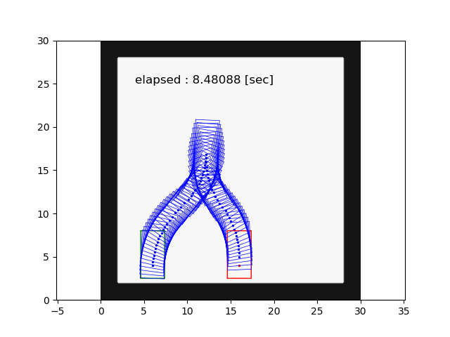

# The `astar_search` package

## Running the standalone node with test problems and visualization

Building the package with ros-test and run it by rosrun:

```
catkin build astar_search --catkin-make-args run_tests
rosrun astar_search astar_search-test
```

Please make sure that roscore is running before running the test.

Inside the test, simulation results were stored in `/tmp/result_multi0.txt`.

Note that the postfix multi or single correspond to
multiple curvatures and single curvature cases.
Loading these resulting files, by using [test/debug_plot.py](test/debug_plot.py),
 one can create plots visualizing the path and obstacles as shown
in the figures below.

The created figures are then again saved in `/tmp` with the name like `/tmp/result_multi0.png`.



The black cells, green box, and red box, respectively, indicate obstacles,
start configuration, and goal configuration.
The sequence of the blue boxes indicate the solution path.

## License notice

Files `src/reeds_shepp.cpp` and `include/astar_search/reeds_shepp.h`
are fetched from [pyReedsShepp](https://github.com/ghliu/pyReedsShepp).
Note that the implementation in `pyReedsShepp` is also heavily based on
the code in [ompl](https://github.com/ompl/ompl).
Both `pyReedsShepp` and `ompl` are distributed under 3-clause BSD license.
