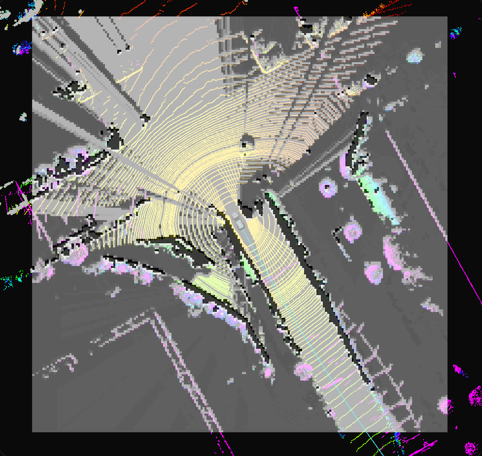

# laserscan_to_occupancy_grid_map

## Purpose

This package outputs the probability of having an obstacle as occupancy grid map.

## Inner-workings / Algorithms

The basic idea is to take a 2D laserscan and ray trace it to create a time-series processed occupancy grid map.

In the first step, the node take a laserscan and make an occupancy grid map with one frame. ray trace is done by Bresenham's line algorithm. Optionally, obstacle point clouds and raw point clouds can be received and reflected in the lumped occupancy grid map.

The second step is to update the existence probability using a binary Bayesian filter, and the unobserved cells are time-decayed like the system noise of the Kalman filter.

## Inputs / Outputs

  ### Input

  | Name                          | Type                       | Description                                                    |
  | ----------------------------- | -------------------------- | -------------------------------------------------------------- |
  | `~/input/laserscan`           | `sensor_msgs::LaserScan`   | laserscan                                                      |
  | `~/input/obstacle_pointcloud` | `sensor_msgs::PointCloud2` | obstacle pointcloud                                            |
  | `~/input/raw_pointcloud`      | `sensor_msgs::PointCloud2` | The overall point cloud used to input the obstacle point cloud |

  ### Output

  | Name                          | Type                      | Description        |
  | ----------------------------- | ------------------------- | ------------------ |
  | `~/output/occupancy_grid_map` | `nav_msgs::OccupancyGrid` | occupancy grid map |

## Parameters

  ### Node Parameters

  | Name                                | Type   | Description                                                                                                                                                    |
  | ----------------------------------- | ------ | -------------------------------------------------------------------------------------------------------------------------------------------------------------- |
  | `map_frame`                         | string | map frame                                                                                                                                                      |
  | `base_link_frame`                   | string | base_link frame                                                                                                                                                |
  | `input_obstacle_pointcloud`         | bool   | whether to use the optional obstacle point cloud? If this is true, `~/input/obstacle_pointcloud` topics will be recieved.                                      |
  | `input_obstacle_and_raw_pointcloud` | bool   | whether to use the optional obstacle and raw point cloud? If this is true, `~/input/obstacle_pointcloud` and `~/input/raw_pointcloud` topics will be recieved. |
  | `use_height_filter`                 | bool   | whether to  height filter for `~/input/obstacle_pointcloud` and `~/input/raw_pointcloud`? By default, the height is set to -1~2m.                              |
  | `map_length`                        | double | The ength of the map. -100 if it is 50~50[m]                                                                                                                   |
  | `map_resolution`                    | double | The map cell resoluation [m]                                                                                                                                   |

## Assumptions / Known limits

In several places we have modified the external code written in BSD3 license.
- occupancy_grid_map.h
- cost_value.h
- occupancy_grid_map.cpp

## (Optional) Error detection and handling

## (Optional) Performance characterization

## (Optional) References/External links

Bresenham's_line_algorithm
- https://en.wikipedia.org/wiki/Bresenham%27s_line_algorithm
- https://web.archive.org/web/20080528040104/http://www.research.ibm.com/journal/sj/041/ibmsjIVRIC.pdf

## (Optional) Future extensions / Unimplemented parts
- The update probability of the binary Bayesian filter is currently hard-coded and requires a code change to be modified.
- Since there is no special support for moving objects, the probability of existence is not increased for fast objects.
